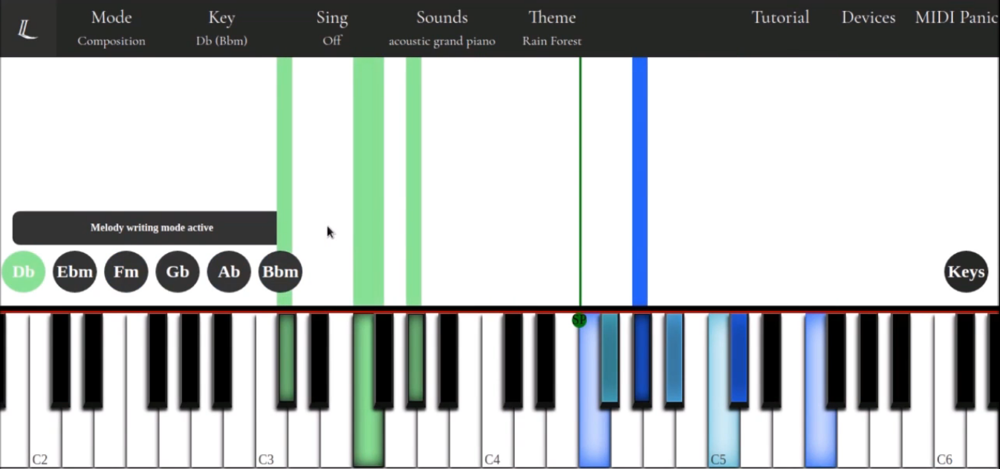

## Lumanote

Play it for free at https://lumanote.net!

Lumanote is a real-time music composition aid. It provides melody and chord suggestions on what to play next through a prioritized key highlighting system. 

When a chord and melody note are played, nearby melody notes are highlighted with different colors (chord tones, whole-step/half-step passing tones, 7th/9th degrees). Conversely playing only a melody note, or singing, will yield possible chords in the selected key signature. Chords are inverted as needed to stay near the split point.  

As a concept an arduino component was developed that lit up the physical keys on an 88-key keyboard with an LED strip. The website has a video that demonstrates the features of the product (arduino component at the very end).
